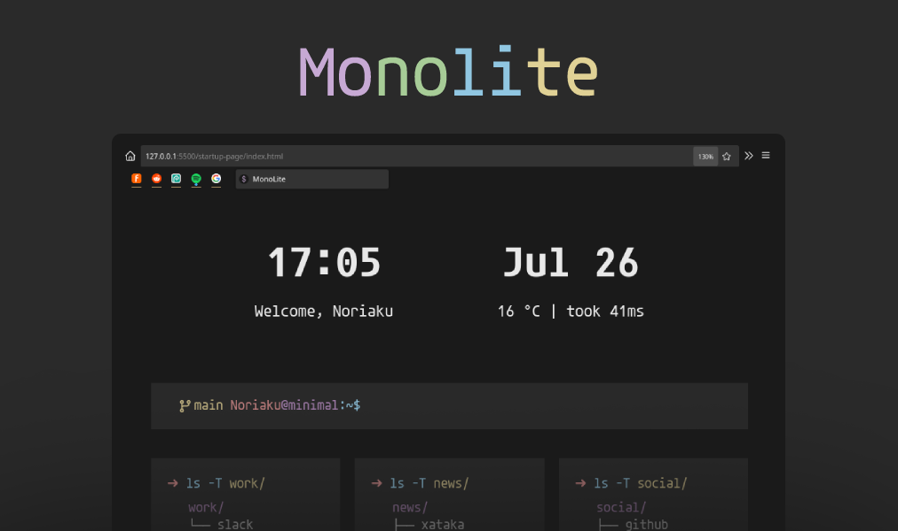

 

    
    

## 🌱 Genesis

Monolite theme aims to combine the beauty of pastel colors with monochromatic tones. Using small fonts, prioritizes screen space for greater vision range and increased productivity. On the other hand, we really recommend to use <a href="https://github.com/noriaku/firefox-monolite/startup-page">monolite startup page</a>, designed for people who love terminal environment feeling & ascii art.

 
## 🦊 Firefox Theme guide

To start, you must clone the repo. You will get also the folder `startup-page`, I really recommend you to follow steps to use it as startpage, cuz works with the same colorscheme and philosophy. 

1. Inside Firefox search at the top bar for `about:support`.
2. In the config accept the risk if asked. Search the following path `Application Basics > Profile Directory > Open Directory`. This gives your Firefox Profile Folder.
3. Move `firefox-monolite/theme/chrome/userChrome.css` inside your Profile Folder.
4. Inside `about:support` set the following properties (changing the boolean value):
    - browser.search.widget.inNavBar: false
    - services.sync.prefs.sync.browser.urlbar.showSearchSuggestionsFirst: false
5. Restart firefox, and be familiar with the keys. 

> Obs. If you want to uninstall the theme, just must remove `chrome` folder inside your Firefox Profile Folder and restart your browser.

## 🚀 Startpage guide 

To start, you must clone the repo and move the folder `startup-page` to a save place. 

1. Click on menu icon in the top right corner in firefox and move to "Home" tab. Or put `about:preferences#home` in your top search bar. 
2. In the "Home" tab, look for "New Windows and Tabs" section.
3. Inside "Homepage and new windows" set the path of startup-page folder with index.html. For example `file:///home/noriaku/Documents/startup-page/index.html` or a URL with your local webserver.

> Obs. I really recommend you to hostself your startup-page using any local webserver, for example, docker looks atractive for me. If not, weather api won't work cuz CORS problems.

## 💡 Shorcuts

1. Open new tab: `Ctrl + T`.
2. Close tab: `Ctrl + W`.
3. Bookmarks: `Ctrl + Shift + B`.
4. Previus page: `Alt + Left arrow`.
5. Next page: `Alt + Right arrow`.
6. Recharge: `Ctrl + R`.
7. Change next tab: `Ctrl + Tab`.
8. Change previous tab `Ctrl + Shift + Tab`.